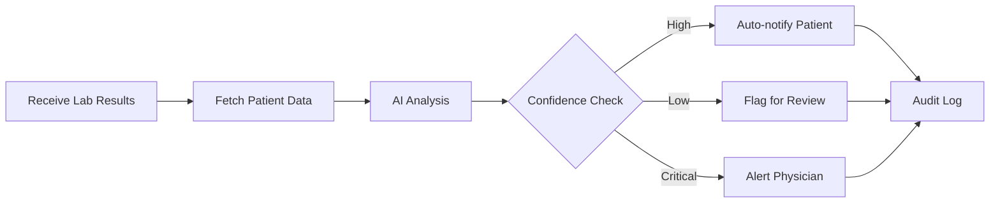

# MediFlow - AI-Orchestrated Lab Result Management System


## Overview

MediFlow is an intelligent healthcare workflow system that uses AI agents to analyze, route, and communicate lab results. It transforms the traditional bottleneck of lab result processing into an efficient, automated pipeline that respects both physician time and patient anxiety.

## Key Features

- 🤖 **Multi-Agent AI System** - Orchestrates specialized AI agents for different medical tasks
- 📊 **Intelligent Lab Result Analysis** - Automatically interprets and triages lab results
- 📱 **WhatsApp Integration** - Instant patient notifications via WhatsApp Business API
- 🔄 **Smart Routing** - Routes results based on urgency and confidence levels
- 🏥 **Healthcare API** - RESTful endpoints for easy integration with existing systems
- 🔐 **Secure Data Handling** - Built with HIPAA compliance in mind
- 📈 **Scalable Architecture** - Designed to handle high volumes of lab results

## Tech Stack

- **Backend**: FastAPI, Python 3.8+
- **AI/ML**: LangChain, LangGraph, Google Gemini 2.0 Flash
- **Database**: Supabase (PostgreSQL)
- **Messaging**: Twilio (WhatsApp/SMS)
- **Deployment**: Render, Uvicorn
- **Environment**: Python-dotenv

## Architecture

```
┌─────────────┐     ┌──────────────┐     ┌─────────────────┐
│   Lab/EMR   │────▶│   FastAPI    │────▶│   AI Agent      │
│   Systems   │     │   Endpoints  │     │   Orchestrator  │
└─────────────┘     └──────────────┘     └─────────────────┘
                            │                      │
                            ▼                      ▼
                    ┌──────────────┐     ┌─────────────────┐
                    │   Patient    │◀────│   Tool Suite:   │
                    │  WhatsApp/   │     │ - Diagnosis     │
                    │     SMS      │     │ - Testing       │
                    └──────────────┘     │ - Notification  │
                                         │ - Data Access   │
                                         └─────────────────┘
```

## Getting Started

### Prerequisites

- Python 3.8 or higher
- pip package manager
- Twilio account (for WhatsApp notifications)
- Google Cloud account (for Gemini API)
- Supabase account (for database)

### Quick Installation

1. Clone the repository:
```bash
git clone https://github.com/yourusername/flow-agent.git
cd flow-agent
```

2. Create virtual environment:
```bash
python -m venv venv
source venv/bin/activate  # On Windows: venv\Scripts\activate
```

3. Install dependencies:
```bash
pip install -r requirements.txt
```

4. Set up environment variables:
```bash
cp .env.example .env
# Edit .env with your credentials
```

5. Run the application:
```bash
uvicorn main:app --reload
```

The API will be available at `http://localhost:8000`

## Configuration

Create a `.env` file in the root directory with the following variables:

```env
# Twilio Configuration
ACCOUNT_SID=your_twilio_account_sid
AUTH_TOKEN=your_twilio_auth_token
TWILIO_WHATSAPP_NUMBER=14155238886  # Twilio sandbox number
PATIENT_WHATSAPP_NUMBER=recipient_phone_number

# Google AI Configuration
GOOGLE_API_KEY=your_google_api_key

# Supabase Configuration (if using custom instance)
SUPABASE_URL=your_supabase_url
SUPABASE_KEY=your_supabase_key
```

## API Documentation

### Endpoints

#### Health Check
```http
GET /
```
Returns a simple health check response.

**Response:**
```json
{
  "Hello": "World"
}
```

#### Process Patient Report (POST)
```http
POST /patient
Content-Type: application/json

{
  "patient_id": "6f5ace3b-fc16-4a32-9b35-1b936af758eb"
}
```

Triggers AI analysis of patient lab results and sends notifications.

**Response:**
```json
{
  "success": true,
  "patient_id": "6f5ace3b-fc16-4a32-9b35-1b936af758eb",
  "message": "Patient report generated successfully",
  "output": "Agent thinking: Analyzing patient data..."
}
```

#### Process Patient Report (GET)
```http
GET /patient/{patient_id}
```

Alternative endpoint for triggering patient report generation.

**Example:**
```bash
curl https://render-fastapi-flow.onrender.com/patient/6f5ace3b-fc16-4a32-9b35-1b936af758eb
```

### Interactive API Documentation

When running locally, visit:
- Swagger UI: `http://localhost:8000/docs`
- ReDoc: `http://localhost:8000/redoc`

## AI Agent Workflow

MediFlow uses a sophisticated multi-agent system powered by LangGraph:

### Available Tools

1. **get_data_tool**: Fetches patient medical history from database
2. **diagnose_tool**: Analyzes medical data and provides preliminary diagnosis
3. **test_tool**: Determines if additional tests are needed
4. **notification_tool**: Sends WhatsApp notifications to patients
5. **output_diagnosis**: Formats and outputs final diagnosis

### Workflow Process



## Testing

### Unit Tests
```bash
python -m pytest tests/
```

### Test WhatsApp Integration
```bash
python twilio-test.py
```

### Test Supabase Connection
```bash
python test.py
```

## Deployment

### Deploy to Render

1. Fork this repository
2. Create a new Web Service on Render
3. Connect your GitHub repository
4. Configure environment variables in Render dashboard
5. Deploy using the provided `render.yaml` configuration

### Manual Deployment

```bash
# Build command
pip install -r requirements.txt

# Start command
uvicorn main:app --host 0.0.0.0 --port $PORT
```

## Project Structure

```
flow-agent/
├── agent/
│   ├── __init__.py
│   └── agent.py          # AI agent orchestration logic
├── main.py               # FastAPI application
├── requirements.txt      # Python dependencies
├── render.yaml          # Render deployment config
├── .env.example         # Environment variables template
├── test.py             # Supabase connection test
└── twilio-test.py      # WhatsApp notification test
```

## Troubleshooting

### Common Issues

**WhatsApp notifications not sending:**
- Verify Twilio credentials in `.env`
- Ensure recipient number is verified in Twilio sandbox
- Check that phone numbers include country code without '+'

**AI agent not responding:**
- Verify Google API key is valid
- Check that Gemini API is enabled in Google Cloud Console
- Ensure you have sufficient API quota

**Database connection errors:**
- Verify Supabase URL and API key
- Check network connectivity
- Ensure patient_id exists in database

## Contributing

We welcome contributions! Please follow these steps:

1. Fork the repository
2. Create a feature branch (`git checkout -b feature/AmazingFeature`)
3. Commit your changes (`git commit -m 'Add some AmazingFeature'`)
4. Push to the branch (`git push origin feature/AmazingFeature`)
5. Open a Pull Request

## Future Roadmap

- [ ] HIPAA compliance certification
- [ ] Support for multiple LLM providers
- [ ] Advanced analytics dashboard
- [ ] Multi-language support
- [ ] Integration with major EMR systems
- [ ] Real-time WebSocket updates
- [ ] Batch processing capabilities

## License

This project is licensed under the MIT License - see the [LICENSE](LICENSE) file for details.

## Acknowledgments

- Built for healthcare providers who need efficient lab result management
- Powered by Google's Gemini AI for medical text analysis
- Special thanks to the LangChain and FastAPI communities

## Contact

For questions or support, please open an issue on GitHub or contact the maintainers.

---

**Note**: This is a prototype system. Always ensure proper medical oversight and compliance with healthcare regulations before deploying in production environments.
